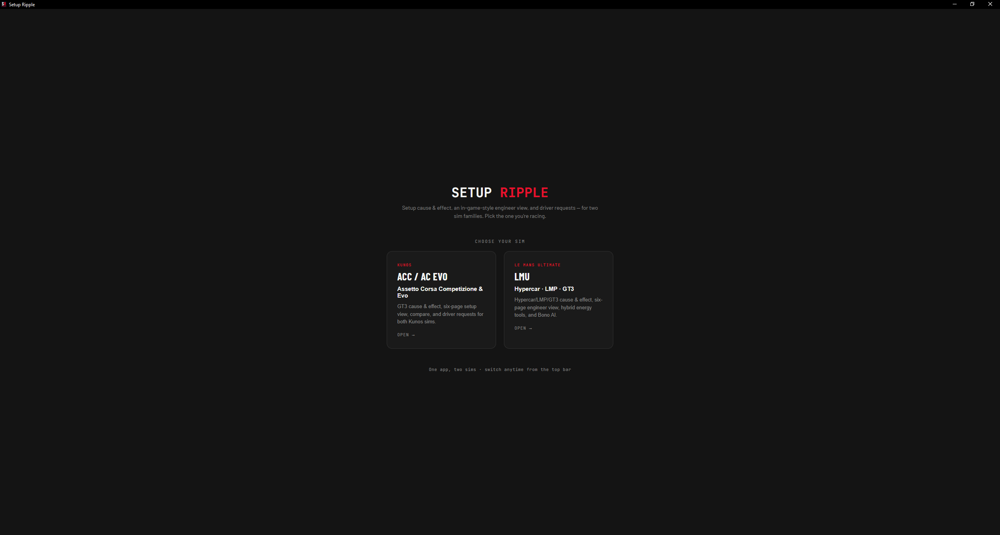
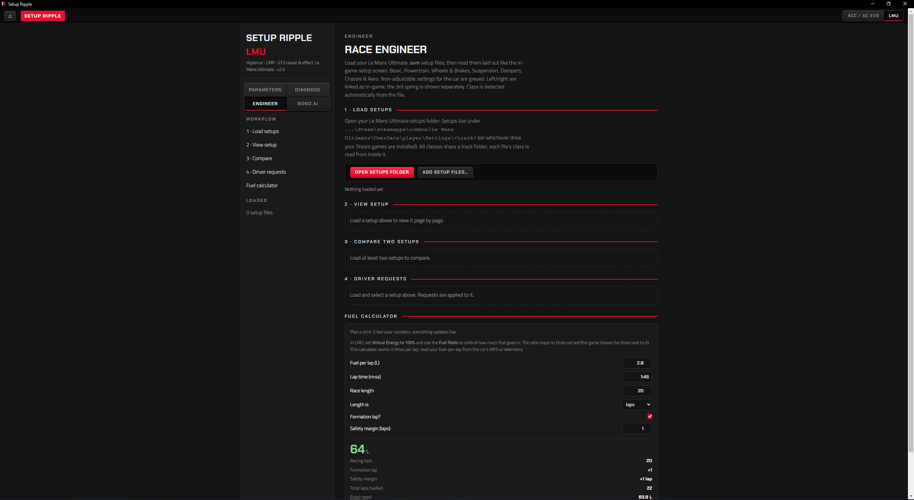
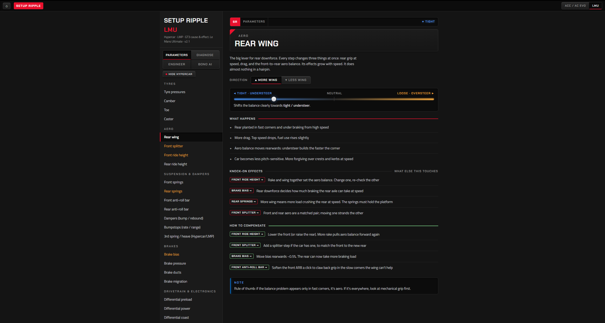

# Setup Ripple

**Every setup change ripples. This shows you where.**

A free desktop tool for sim racers. One app, two sim families : **Assetto Corsa Competizione / AC Evo** and **Le Mans Ultimate**.

Load your real setup files, read them laid out like the in-game setup screen, understand what each setting actually does, and make changes one click at a time. Your original files are never touched.

<!-- SCREENSHOT: the launcher / sim chooser -->

---

## What it does

**Engineer** : Load your setup files and read them page by page, mirroring each game's own setup screen. Compare any two setups and see exactly what changed. Nudge any adjustable setting with ◄ ► buttons and save the result as a new file.

<!-- SCREENSHOT: six-page Engineer view with nudge buttons -->

**Parameters** : What every setting actually does, and what it costs you. Not just "more wing = more grip", but the knock-on effects, what to change to compensate, and when the change is worth it.

<!-- SCREENSHOT: a Parameters page -->

**Diagnose** : Start from the problem, not the setting. "The rear steps out as I brake" → the likely causes, ranked, with the usual fixes.

**Driver requests** : Pick a handling complaint and the app stages the usual fixes for you. Review them, adjust, save.

**Fuel calculator** : Plan a stint from your real fuel-per-lap.

**Bono AI** *(optional)* : A local AI race engineer that can read your setups and talk them through with you. **This one requires your own Claude Code : see below.**

---

## Supported sims

| Sim | Classes | Setup files |
|---|---|---|
| Assetto Corsa Competizione | GT3 | `.json` |
| Assetto Corsa Evo | GT3 | `.carsetup` |
| Le Mans Ultimate | Hypercar, LMP2, LMP3, LMGT3 | `.svm` |

ACC values are shown as setup-screen clicks, exactly as the game shows them. AC Evo values are decoded to real physical units (psi, degrees, N/m, mm). LMU reads each car's class straight from the file.

---

## Install

1. Download the latest `.exe` from [**Releases**](../../releases).
2. Run it. That's it : it's portable, nothing to install.

**Windows will warn you the app is unsigned.** Click **More info → Run anyway**. Code signing certificates cost money and require identity verification; this is a free tool from an independent developer, so it isn't signed. The source is right here if you'd rather read it or build it yourself.

---

## About Bono AI

Bono is optional. **Everything else in Setup Ripple works without it.**

Bono runs through **your own [Claude Code](https://claude.ai/code) install and your own Claude account** : it is not included, and there's no API key baked into the app. If you don't have Claude Code, Bono will simply tell you so and the rest of the app carries on as normal.

This is deliberate: it means your setups stay on your machine, nothing is sent anywhere by this app, and there's no service for me to run or charge you for.

---

## Your files are safe

Setup Ripple **never overwrites your originals.** Every edit is saved as a new file alongside the original, so a bad experiment costs you nothing.

---

## Bugs, ideas, requests

Open an [issue](../../issues). Bug reports and feature requests both welcome : tell me the sim, the car, and what you expected to happen.

---

## Disclaimer

An independent community tool. Not affiliated with Kunos Simulazioni, 505 Games, Studio 397, Motorsport Games, or Le Mans Ultimate. Setup values and advice are a reference, not gospel : the stopwatch is the final judge.

## Licence

MIT : see [LICENSE](LICENSE).
